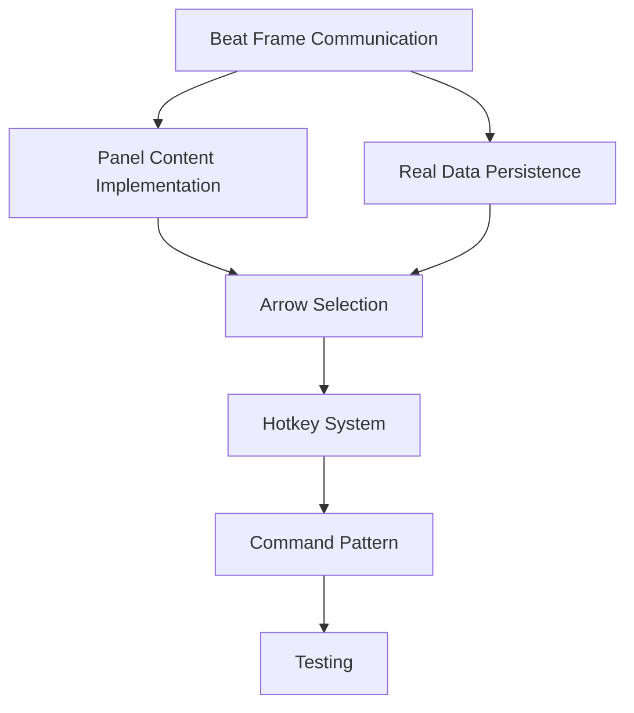

# TKA Graph Editor Migration Plan

## Legacy to Modern Architecture Migration

### Overview

This document outlines the complete migration of the legacy graph editor to modern TKA architecture. The graph editor is now positioned in the RIGHT PANEL of the main widget (not a slide-up workbench component), which significantly simplifies the implementation.

### Critical Architecture Changes

- **Location**: RIGHT PANEL of main widget (not slide-up workbench component)
- **No Animation System**: Removed slide-up/down animations (no longer needed)
- **Exact Legacy UI**: Match legacy buttons, controls, and user interactions precisely
- **Beat Frame Integration**: Beat selection must automatically open corresponding adjustment panel

### Current Implementation Status

#### ✅ COMPLETED

- Basic GraphEditor component structure
- GraphEditorLayoutManager for UI setup
- GraphEditorStateManager for state tracking
- GraphEditorSignalCoordinator for signal management
- Basic AdjustmentPanel structure
- GraphEditorPictographContainer foundation
- Service interfaces (IGraphEditorService)
- **Beat Frame Communication**: ✅ IMPLEMENTED - Beat selection signals connected to graph editor
- **Panel Switching Logic**: ✅ IMPLEMENTED - Start position shows orientation picker, beats show turns panels

#### 🔴 CRITICAL GAPS

1. **Real Data Persistence**: All service methods are placeholders
2. **Arrow Selection Logic**: No visual feedback or interaction
3. **Panel Content**: Adjustment panels show placeholder content
4. **Hotkey System**: No keyboard input handling
5. **State Synchronization**: Components don't communicate properly

### Migration Phases

## Phase 1: Core Data Flow (HIGHEST PRIORITY)

### 1.1 Beat Frame → Graph Editor Communication

**Files to Modify:**

- `src/desktop/modern/src/presentation/tabs/construct/layout_manager.py`
- `src/desktop/modern/src/presentation/components/workbench/graph_editor/graph_editor.py`

**Implementation:**

```python
# Connect beat frame selection to graph editor
self.beat_frame.beat_selected.connect(self.graph_editor.handle_beat_selection)
self.graph_editor.beat_modified.connect(self.beat_frame.update_beat_display)
```

### 1.2 Real Data Persistence in GraphEditorService

**File:** `src/desktop/modern/src/application/services/graph_editor_service.py`

**Replace placeholder methods with real implementations:**

- `apply_turn_adjustment()` - Save to repository
- `apply_position_adjustment()` - Update special placement data
- `set_selected_beat()` - Persist selection state
- `update_beat_adjustments()` - Apply changes to beat data

### 1.3 Panel Content Implementation

**File:** `src/desktop/modern/src/presentation/components/workbench/graph_editor/components/adjustment_panel.py`

**Add real controls:**

- Orientation picker with exact legacy options
- Turns box with exact legacy turn values
- Panel switching based on beat type (start position vs regular beat)

## Phase 2: User Interaction Systems

### 2.1 Arrow Selection with Visual Feedback

**File:** `src/desktop/modern/src/presentation/components/workbench/graph_editor/components/pictograph_container.py`

**Implementation:**

- Click-to-select arrows in pictograph
- Gold border highlighting for selected arrows
- Arrow selection state management
- Real-time pictograph updates

### 2.2 Hotkey System Implementation

**New File:** `src/desktop/modern/src/presentation/components/workbench/graph_editor/hotkey_handler.py`

**Hotkeys to implement:**

- WASD: Arrow movement
- X: Rotation angle override
- Z: Remove special placement entry
- C: Prop placement override

### 2.3 Panel Switching Logic

**Enhancement to adjustment_panel.py:**

- Detect start position vs regular beat
- Show orientation picker for start positions
- Show turns box for regular beats
- Maintain exact legacy UI patterns

## Phase 3: Data Integration

### 3.1 Repository Pattern Implementation

**New Files:**

- `src/desktop/modern/src/domain/repositories/beat_repository.py`
- `src/desktop/modern/src/infrastructure/repositories/json_beat_repository.py`

**Integration with legacy JSON files:**

- Read/write special placement data
- Maintain compatibility with legacy data format
- Ensure data consistency across applications

### 3.2 Command Pattern for Undo/Redo

**New Files:**

- `src/desktop/modern/src/domain/commands/graph_editor_commands.py`
- `src/desktop/modern/src/application/services/command_service.py`

**Commands to implement:**

- TurnAdjustmentCommand
- PositionOverrideCommand
- ArrowSelectionCommand

## Phase 4: Testing and Validation

### 4.1 Unit Tests

**Test Files to Create:**

- `tests/desktop/modern/application/services/test_graph_editor_service.py`
- `tests/desktop/modern/presentation/components/test_graph_editor.py`

### 4.2 Integration Tests

**Test beat frame → graph editor communication:**

- Beat selection triggers panel opening
- Panel changes persist to data layer
- State synchronization works correctly

### 4.3 End-to-End Validation

**Compare against legacy behavior:**

- Same user workflows work identically
- Same visual feedback and interactions
- Same data persistence patterns

### Implementation Dependencies



### Success Criteria

1. ✅ Beat clicking opens corresponding graph editor panel
2. ✅ Adjustment controls modify beat data and persist changes
3. ✅ Arrow selection works with visual feedback
4. ✅ Hotkeys function identically to legacy
5. ✅ All user workflows match legacy behavior exactly
6. ✅ Data persistence maintains legacy compatibility
7. ✅ No regressions in existing functionality

### Files Requiring Immediate Attention

1. `layout_manager.py` - Connect beat frame to graph editor
2. `graph_editor_service.py` - Implement real data persistence
3. `adjustment_panel.py` - Add real panel content
4. `pictograph_container.py` - Implement arrow selection
5. `graph_editor.py` - Add hotkey handling

### Notes for Future Implementation

- Keep legacy UI patterns exactly - no over-engineering
- Focus on functionality over architectural purity
- Test each component as it's implemented
- Maintain backward compatibility with legacy data
- Document any deviations from legacy behavior
