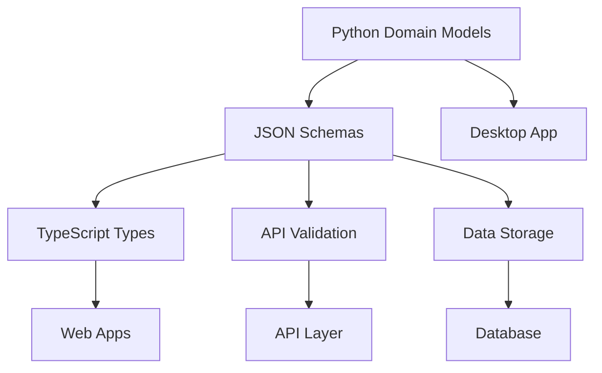

# TKA Schema Architecture

> **Critical Infrastructure** - This directory contains JSON schemas that maintain data consistency across the entire TKA multi-platform ecosystem.

## 🎯 Purpose

The TKA schemas serve as the **single source of truth** for data structures shared between:
- **Desktop Application** (Python/PyQt6)
- **Web Applications** (TypeScript/React)
- **API Services** (FastAPI)
- **Data Storage** (JSON/SQLite)

## 🏗️ Architecture Overview



### Data Flow
1. **Python Domain Models** define business logic in `src/desktop/modern/src/domain/models/`
2. **JSON Schemas** provide platform-agnostic contracts
3. **TypeScript Types** are auto-generated for web applications
4. **Runtime Validation** ensures data integrity across platforms

## 📋 Schema Files

### Core Foundation
| File | Purpose | Dependencies |
|------|---------|--------------|
| `core-enums.json` | All enumeration types | None |
| `motion-data.json` | Motion/animation data | `core-enums.json` |
| `beat-data.json` | Individual beat structure | `motion-data.json`, `glyph-data.json` |
| `sequence-data.json` | Complete sequences | `beat-data.json` |

### Specialized Schemas
| File | Purpose | Use Case |
|------|---------|----------|
| `glyph-data.json` | Pictograph rendering | Visual representation |
| `beat-data-simple.json` | Simplified beat format | Legacy compatibility |

### Generated Assets
| File | Purpose | Generated From |
|------|---------|---------------|
| `generated-types.ts` | TypeScript interfaces | All JSON schemas |

## 🔧 Usage Examples

### Python (Desktop)
```python
from src.domain.models import BeatData, MotionData
from src.infrastructure.validation import validate_against_schema

# Create domain object
beat = BeatData(
    beat_number=1,
    letter="A",
    motion_data=MotionData(...)
)

# Validate against schema
validated_data = validate_against_schema(beat.to_dict(), "beat-data.json")
```

### TypeScript (Web)
```typescript
import { BeatData, MotionData } from './generated-types';
import { validateBeatData } from '../validation/schema-validator';

// Type-safe data handling
const beat: BeatData = {
  beatNumber: 1,
  letter: "A",
  motionData: { ... }
};

// Runtime validation
if (validateBeatData(beat)) {
  // Guaranteed valid data
  processBeat(beat);
}
```

### API Validation
```python
from fastapi import FastAPI, HTTPException
from pydantic import ValidationError
from schemas.validators import BeatDataValidator

@app.post("/api/beats")
async def create_beat(beat_data: dict):
    try:
        validated = BeatDataValidator.validate(beat_data)
        return create_beat_from_data(validated)
    except ValidationError as e:
        raise HTTPException(400, detail=e.errors())
```

## 🔄 Schema Evolution

### Versioning Strategy
- **Semantic Versioning**: `v2.0.0` format
- **Backward Compatibility**: Older versions supported
- **Migration Paths**: Documented upgrade procedures

### Update Process
1. **Modify Python Domain Models** (source of truth)
2. **Regenerate JSON Schemas** from models
3. **Update TypeScript Types** via code generation
4. **Validate Cross-Platform Compatibility**
5. **Update Version Numbers** and changelog

## 🛠️ Development Tools

### Schema Validation
```bash
# Validate schema syntax
npx ajv-cli validate --spec=draft7 schemas/*.json

# Test schema against sample data
npx ajv-cli test -s schemas/beat-data.json -d test-data/sample-beat.json
```

### Type Generation
```bash
# Generate TypeScript types
npx json-schema-to-typescript \
  --input schemas/ \
  --output src/web/types/generated/
```

### Schema Testing
```python
# Python schema validation tests
pytest tests/schemas/ -v

# Cross-platform compatibility tests
python scripts/test_schema_compatibility.py
```

## 📚 Schema Reference

### Core Enums
All enumeration values used throughout TKA:
- **MotionType**: `pro`, `anti`, `float`, `dash`, `static`
- **HandPath**: `cw`, `ccw`, `dash`, `static`
- **GridPosition**: `alpha1`-`alpha8`, `beta1`-`beta8`, `gamma1`-`gamma16`
- **ElementalType**: `water`, `fire`, `earth`, `air`, `sun`, `moon`

### Validation Rules
- **Required Fields**: Enforced at schema level
- **Type Safety**: Strict typing across platforms
- **Range Validation**: Numeric bounds and constraints
- **Format Validation**: String patterns and formats

## 🚀 Future Enhancements

### Planned Features
- [ ] **Auto-Generation Pipeline** from Python dataclasses
- [ ] **Schema Registry** with version management
- [ ] **Migration Tools** for data format changes
- [ ] **Performance Schemas** for optimization tracking
- [ ] **Animation Schemas** for complex motions
- [ ] **User Preference Schemas** for customization
- [ ] **Plugin Schemas** for extensibility

### Integration Roadmap
- [ ] **GraphQL Schema** generation
- [ ] **OpenAPI** specification sync
- [ ] **Database Schema** migration tools
- [ ] **Real-time Validation** in editors
- [ ] **Schema Documentation** generation

## ⚠️ Important Notes

### Do Not Modify Directly
- These schemas are generated from Python domain models
- Manual changes will be overwritten
- Always update the source Python models first

### Breaking Changes
- Schema changes can break web applications
- Always test cross-platform compatibility
- Use deprecation warnings for removed fields
- Maintain backward compatibility when possible

### Performance Considerations
- Large sequences should use streaming validation
- Consider schema caching for repeated validations
- Monitor validation performance in production

---

## 🔗 Related Documentation

- [Python Domain Models](../src/desktop/modern/src/domain/models/README.md)
- [Web Type System](../src/web/README.md)
- [API Documentation](../docs/api/README.md)
- [Migration Strategy](../.venv/src/tka/schemas/MIGRATION_STRATEGY.md)

---

**This schema system is mission-critical infrastructure. Treat it with the respect it deserves!** 🏗️✨